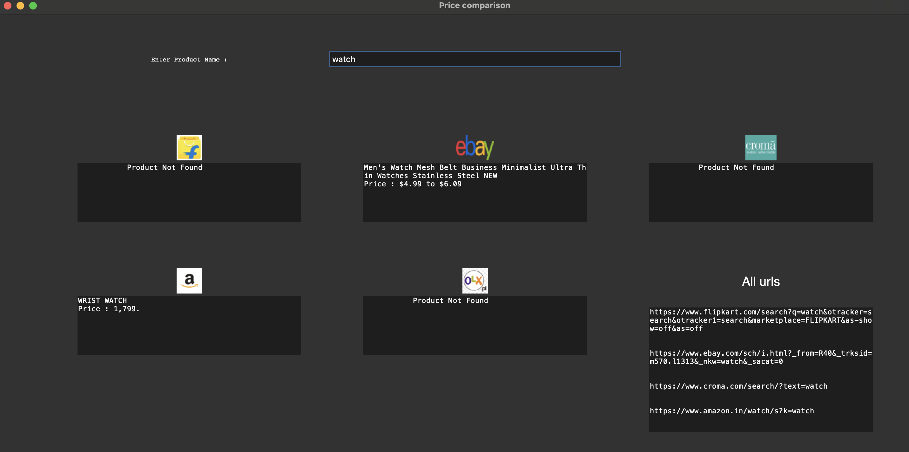

# PriceComparison

Uses python `tkinter` to display what `requests` gets from provided keyword

Everything wrong with it -
- The motive??
- The interface
- The awful loooooooooooooot of loading time

Really ugly, I know  

